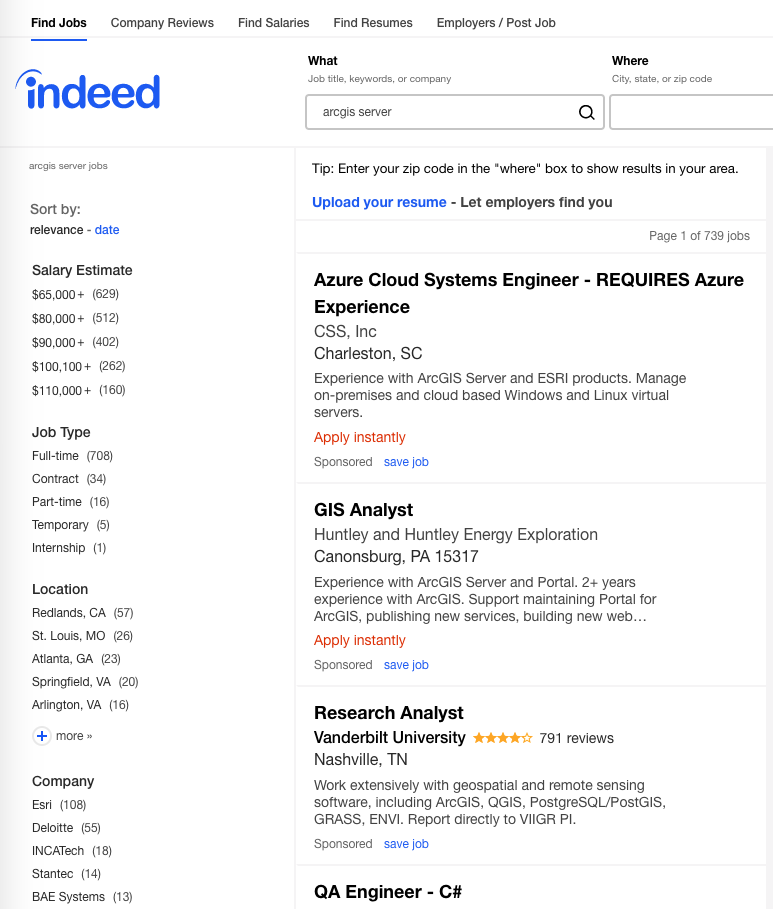

# Assignment: Open Source Jobs
## Worth: 30 points
## Due: 3 days

## Background

Job opportunities related to GIS are typically tagged with specific technologies; either because the job requires you to work in an existing technological ecosystem or because the author of the job advertisement was experienced with those technologies. Searching job sites based on those technologies can provide insight into what types of jobs are being targeted at different audiences. When an employer posts a job advertisement they may advertise with any number of online job advertising websites. Additionally, jobs may be aggregated or crosslisted. One such website, http://indeed.com, summarizes salary expectations across the search keywords that potential candidates uses. For this assignment, you will search for jobs on Indeed using keywords for technologies that you know from your previous GIST classes and for technologies that you will be learning about in this class. 

I will provide one example using a proprietary technology you may be familiar with, `ArcGIS Server` and `geoserver`. While the technologies differ in important ways, they are the two most common commercial and open source server-side solutions for providing geospatial data, maps, and processing services to both Desktop and API-based geospatial clients.

### Indeed job search for "arcgis server"
  

### Indeed job search for "geoserver"
 

## Assignment

Create a file named `answers.txt` containing your short answer responses to the following questions. 

1. How do the results compare between job search results for "arcgis server" vs. "geoserver"? Discuss your findings with respect to number of jobs, salaries, and types of jobs. Be aware of jobs that are tagged as "sponsored".

2. Look through the class syllabus and search for additional technologies and compare the job search results to searches with similar software you know (e.g., arcgis vs. qgis, sde vs. postgis, arcgis javascript vs. openlayers or leaflet.

3. Perform similar searches as above but add "git" or "docker" to the search query. How does that change the search results? 

4. Assume you have acquired the skills listed in the syllabus. Find one job advertisement that you would not have otherwise found or realized you were qualified for. Describe why that job is interesting to you and why it would not have been on your radar previously.

### 5. Notify instructor the assignment is done through Slack. 

Send a DM through slack to the instructor indicating that this assignment is complete (link to this url).
